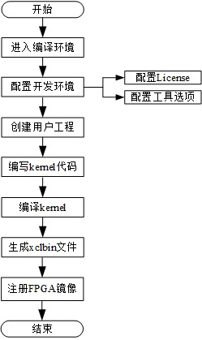
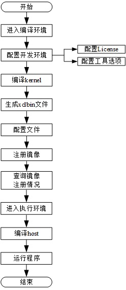

# fp1开发套件说明

---
[Switch to the English version](./README.md)

## 目录
-------
1. [fp1开发套件](#sec-1)
2. [目录结构](#sec-2)
3. [目录说明](#sec-3)
4. [通用型架构FPGA开发指南](#sec_3)
   * [4.1 通用型架构硬件开发流程](#sec_3_1)
   * [4.2 通用型架构软件开发流程](#sec_3_2)
   * [4.3 使用基于SDAccel的Example](#sec_3_3)

本开发套件对用户服务器的依赖如下：

| 类型        | 说明                                       |
| --------- | ---------------------------------------- |
| 操作系统      | Linux centos 7.3                         |
| 内存        | >=37GByte                                |
| 硬盘        | 安装SDx工具前>=100GByte                       |
| SDx工具安装路径 | 必须安装在文件夹/software下                       |
| license特性 | （1）XCVU9P、（2）PartialReconfiguration、（3）Simulation 1735 Version 2、（4）xcvu9p_bitgen、（5）ap_opencl |
| SDx工具版本   | 2017.4.op                                |

# 1 fp1开发套件

---

**fp1**是一款基于FACS的开源的云化FPGA硬件与软件开发工具套件。该套件不仅能够帮助用户完成设计、实现以及联合运行，而且为用户提供专业的设计以及验证组件，帮助开发者更高效的实现FPGA的开发。

**fp1**主要由两部分组成，**硬件开发套件**（**HDK**）与**软件开发套件**（**SDK**）。其中HDK包括从设计、验证到构建的全部设计文件以及脚本。SDK则主要包含运行FPGA实例所需要的驱动、工具、运行环境以及应用程序。

# 2 目录结构

---

- **fp1/**
  - [hardware/](#sec-3-1)
  - [software/](#sec-3-2)
  - [tools/](#sec-3-3)
  - [docs/](#sec-3-4)
  - [release_note_cn.md](#sec-3-5)
  - [setup.cfg](#sec-3-8)
  - [setup.sh](#sec-3-9)
  - [FAQs_cn.md](#sec-3-10)

# 3 目录说明

---

- hardware

  用于存放fp1的硬件开发套件，包括SDAccel开发工具套件。可以选择SDAccel作为开发工具，使用c、c++或openCL高级语言开发。

  详细说明见[hardware目录说明](./hardware/README_CN.md)。

- software

  用于存放fp1的软件开发套件，包括实例运行时所需要的运行环境、驱动、工具以及相关应用程序。

  详细说明见[software目录说明](./software/README_CN.md)。

- tools

  用于存放fp1平台下FPGA开发时所需的工具。

- docs

  用于存放FPGA开发套件指导文档，包括硬件开发流程以及示例的如何使用等。

- release_note_cn.md

  fp1的版本使用说明，包括工程构建、用户仿真、应用测试等说明。

- setup.cfg

  用户配置文件，包含工具的选择、license配置及SDx版本配置。

- setup.sh

  环境变量设置及配置检查脚本,用户使用开发套件前需要执行。

- FAQs_cn

  常见问题解答及高危操作描述。

# 4 通用型架构FPGA开发指南
通用型架构FPGA开发包括硬件开发、软件开发和使用Example三个场景。在硬件开发场景下，用户通过使用基于SDAccel的工具套件完成FPGA镜像文件的生成和注册；在软件开发场景下，用户可基于已有的FPGA镜像文件开发自己的应用；在使用Example时，用户可以通过示例的使用快速掌握在当前服务器架构下的FPGA开发流程。

+ [4.1 通用型架构硬件开发流程](#sec_3_1)
+ [4.2 通用型架构软件开发流程](#sec_3_2)
+ [4.3 使用基于SDAccel的Example](#sec_3_3)

## 4.1 通用型架构硬件开发流程

> 如果用户已于线下实现kernel的编译工作，并生成相应的xclbin文件，后续操作请参见[基于SDAccel的线下开发线上使用流程说明](./docs/SDAccel-based_offline_development_online_use_process_guidance_cn.md)。

用户在选择通用型架构时，硬件开发是基于SDAccel的流程。本流程可以指导用户完成工程创建、工程编译、工程仿真、生成xclbin文件，最终完成FPGA镜像（AEI，Accelerated Engine Image）的注册。用户在完成硬件开发后，如果需要基于已注册的FPGA镜像开发自己的应用，请参见4.2节内容。

### 4.1.1 生成xclbin文件
基于SDAccel的xclbin文件开发详细步骤，请参见[基于SDAccel的硬件开发流程](./docs/Implementation_Process_of_SDAccel_based_Hardware_Development_cn.md)。

### 4.1.2 注册FPGA镜像
注册FPGA镜像依赖镜像管理工具Fisclient，如果您还未安装此工具，请参照根目录相关章节完成镜像管理工具的安装及配置。在工具安装成功后，用户使用AEI_Register.sh工具向FPGA镜像管理模块注册FPGA镜像。注册的详细步骤请参见[注册FPGA镜像](./docs/Register_an_FPGA_image_for_an_OpenCL_project_cn.md)。完成注册后，请记录并妥善保存返回结果里的ID，此ID将用于查询FPGA镜像的注册操作是否成功以及后续的软件开发中。

## 4.2 通用型架构软件开发流程

如果用户已完成硬件开发，注册了FPGA镜像，则可以按照本章内容完成FPGA用户应用的开发。

### 4.2.1 编写与调试用户应用
通用型架构开发模式采用Xilinx的SDAccel架构完成FPGA与处理器的数据交互，编写和调试用户应用的方法请参见[基于SDAccel的用户应用开发说明](./software/app/sdaccel_app/README_CN.md)。
如果用户需要修改HAL，请参见[SDAccel模式HAL开发说明](./software/userspace/sdaccel/README_CN.md)。

### 4.2.2 运行用户应用

用户在完成FPGA镜像加载和应用编译后，进入目录`ctyun-fpga/fp1/software/app/sdaccel_app`执行用户程序。

## 4.3 使用基于SDAccel的Example
在通用型服务器架构下，天翼FPGA云加速服务提供了三种Example。Example1是一个矩阵乘法实例，基于c实现逻辑算法；Example2是一个矢量相加的实例，采用opencl c实现逻辑算法；Example3是一个矢量相加的实例，采用rtl来实现其逻辑功能。基于SDAccel的Example操作流程如下图所示。

基于SDAccel的Example详细说明请见[使用基于SDAccel的Example](./docs/Using_an_SDAccel_based_Example_cn.md)。

